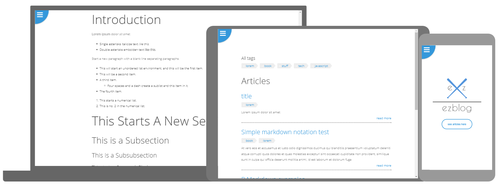

<p align="center">
    
</p>

# EZBLOG
A simple blog without backend, write your articles in mardown and deploy the app everywhere (in my case gh-pages).

<p align="center">
    
</p>

## How to use it ?
### Project dependencies
Obviously download the project dependencies, you can do so by running the following command :
```bash
$ npm install
```
### Articles informations
Edit `src/articles-in.json` with your articles details.  
Exemple of `src/articles-in.json` : 
```
[
  {
    "id":1,"title":"title",
    "file":"title1.md",
    "text":"",
    "date":"Jeudi, 1 Juin 2017",
    "preview":"Lorem ipsum dolor sit amet",
    "tags" : ["lorem"]
  },
 ...
  {
    "id":4,
    "file":"why-javascript-is-so-fucking-awesome.md",
    "title":"Why javascript is so fucking awesome" ,
    "text":"", "date":"Jeudi, 1 Juin 2017",
    "preview":"Lorem ipsum dolor sit amet",
    "tags" : ["tech","javascript"]
  },
  {
    "id":5,
    "file":"react.md",
    "title":"React read me" ,
    "text":"", "date":"Jeudi, 1 Juin 2017",
    "preview":"basicaly the react readme.md",
    "tags" : ["javascript"]
  }
  ]
```
### Articles content
Write the content of your articles in `src/articles/`  
Make sure that the file name match the file attribute in `src/articles-in.json`  
After editing the articles-in.json you can run this commande to update the articles.json file with the content of your articles :
```bash
$ npm run convert
```

You can now run the server localy or deploy it to github-pages : 
```bash
# Run development server
# this start a server localy with live reload
$ npm start

# Deploy to github-pages
$ npm run deploy
```
### tl;dr
```bash
$ npm install
# Edit `src/articles-in.json`
# Write the content of your articles in `src/articles/`
$ npm run convert
$ npm run deploy
```
<p align="center">
    
</p>

## About the project 
This project was bootstrapped with [Create React App](https://github.com/facebookincubator/create-react-app).  

  
Made with :heart: by Dan
